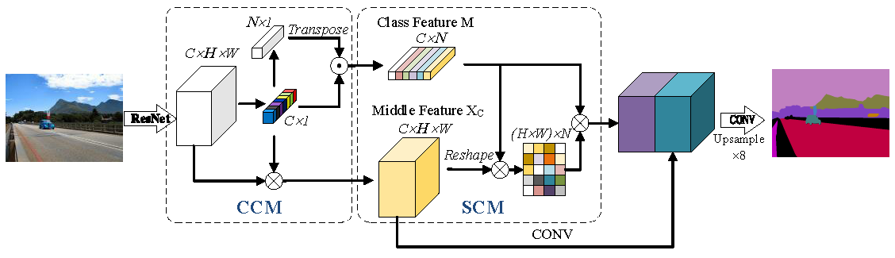

## [CTNet: Context-based Tandem Network for Semantic Segmentation](https://arxiv.org/abs/2104.09805)
By Zechao Li, Yanpeng Sun, Liyan Zhang and Jinhui Tang
## Updates
2021/09: Code based on [PaddlePaddle](https://www.paddlepaddle.org.cn/) released.
## Introduction
### CTNet framework

### CCM and SCM Modules
<br/>
## Usage 
### 1. Install paddle
To install [PaddlePaddle==2.0.2](https://www.paddlepaddle.org.cn/install/old?docurl=/documentation/docs/zh/install/conda/linux-conda.html) (The code is test in the environment with  ```Python=3.6, CUDA=11.2```)
### 2. Clone the resposity
   ```
   git clone https://github.com/syp2ysy/CTNet.git
   cd CTNet
   ```
### 3. Install Requirements
  ```
  pre-commit
  yapf
  flake8
  pyyaml >= 5.1
  visualdl >= 2.0.0
  opencv-python
  tqdm
  filelock
  scipy
  prettytable
   ```
### 4. Datasets
- Download the datasets. for example: [Cityscapes](https://www.cityscapes-dataset.com/) and [PASCAL Context](https://www.cs.stanford.edu/~roozbeh/pascal-context/).
```
cd ./CTNet/tools
python convert_cityscapes.py
   ... 
   ...
```
### 5. Training

```
export CUDA_VISIBLE_DEVICES=0, 1
python -m paddle.distributed.launch train.py \
       --cfg ./configs/ctnet/ctnet_hrnetw48_cityscapes_1024x512_160k.yml \
       --do_eval \
       --use_vdl \
       --save_interval 4000 \
       --save_dir output_hr48_city
```
### 6. Evaluation
Evaluation for SS
```
python val.py \
       --config ./configs/ctnet/ctnet_hrnetw48_cityscapes_1024x512_160k.yml \
       --model_path ./output_hr48_city/best_model/model.pdparams
```
Evaluation for MS+flip
```
python val.py \
       --cfg ./configs/ctnet/ctnet_hrnetw48_cityscapes_1024x512_160k.yml \
       --model_path ./output_hr48_city/best_model/model.pdparams \
       --aug_eval \
       --scales 0.75 1.0 1.25 1.5 1.75 \
       --flip_horizontal
```
### 7. Results
Cityscapes

| Method | Backbone   | JPU  | Dilated | mIoU | mIoU (ms+flip) | Links |
| :----: | :--------: | :--: | :--: | :--: | :---: | :----: |
| CTNet  | ResNet-101 | - | √ | 80.8 | 81.4 | [model](https://drive.google.com/file/d/1YA3Un5nVGAUnJ2QOwphaVlQoypYd_5WA/view?usp=sharing)      |
| CTNet  | ResNet-101 | √ | - | 80.4 | 81.2 | [model](https://drive.google.com/file/d/1BcUaR1K4UVx_hS3hYpzN2DS4_jTFCdni/view?usp=sharing) |
| CTNet | HRNet_w48 | - | - | 82.3 | 82.8 | [model](https://drive.google.com/file/d/1ZQEuq2IS2kHUc00IF71bAg0upg8qZO02/view?usp=sharing) |

## Citation
If you find this work is helpful in your research, please cite:
```
@article{li2021ctnet,
  title={Ctnet: Context-based tandem network for semantic segmentation},
  author={Li, Zechao and Sun, Yanpeng and Zhang, Liyan and Tang, Jinhui},
  journal={IEEE Transactions on Pattern Analysis and Machine Intelligence},
  year={2021},
  publisher={IEEE}
}
```
## Acknowledgement
Thanks to [PaddleSeg](https://github.com/PaddlePaddle/PaddleSeg), [FastFCN](https://github.com/wuhuikai/FastFCN) and [HRNet](https://github.com/HRNet/HRNet-Semantic-Segmentation) for their help in this work.

